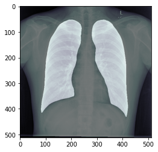

# Lung Area Segmentation using Bidirectional Convolutional UNet and deployment of the model uisng fast api and docker over AWS EC2 instance

- Created a Lung Area Segmentation model using Bidirectional Convolutional UNet which was propoed by Aad et al[1].
- The features of the Bi-Directional Conv Lstm Unet (BDCLUnet) are as follows: 
  - There are four steps in the contracting path of BCDU-Net. In each step two convolutional 3×3 filters are followed by a 2 × 2 max 	pooling function and a ReLU.
  - Feature maps are also doubled at each step. 
  - In the decoding path, the up-sampling functions are performed. 
  - The corresponding feature maps in the contracting path are cropped and copied to the decoding path, in the standard U-Net. 
  - These feature maps and the output of the up-sampling function are then concatenated.
  - The spatial correlations are not taken into account by the standard LSTM.  
  - ConvLSTM [5] was proposed to solve this problem,  and convolution operations between state-to-state transitions and input-to-		state transitions were used.
- The trained model achieved a dice coefficient of 0.9789.
- The code for the architecture and the training of the model is in lung area segmentaion model.ipynd

## Serving the model asi an api using fastApi 
- Used FastApi for deployment of the model
- When talking about deploying, what is usually meant is to put all of the software required for predicting in a server. By doing this, a client can interact with the model by sending requests to the server.
- The API was coded using fastAPI but the serving was done using uvicorn, which is a really fast Asynchronous Server Gateway Interface (ASGI) implementation.  
- With fastAPI you can create web servers to host your models very easily. Additionally, this platform is extremely fast and it has a built-in client that can be used to interact with the server. 

## Deployemnt over AWS EC2 instance using Docker to contanerize the app

- Create an AWS EC2 intance
- Intall Docker on it
- Create a Repository in AWS ECR
- Create an IAM role with ContainerRegistryFullAccess
- Assign the role to EC2 instance
- Download pythonApp from Github.
- Build docker image for the Python App
- Push docker image to ECR
- Run python app in Docker container

### References
[1] Azad, Reza, et al. "Bi-directional ConvLSTM U-net with Densley connected convolutions." Proceedings of the IEEE International Conference on Computer Vision Workshops. 2019.
